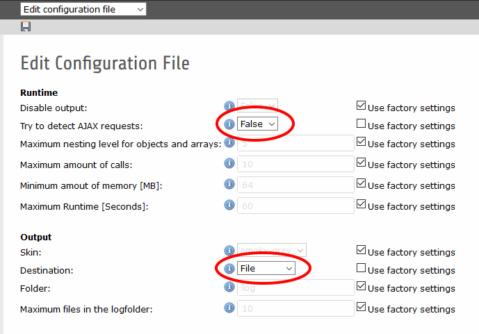

.. ==================================================
.. FOR YOUR INFORMATION
.. --------------------------------------------------
.. -*- coding: utf-8 -*- with BOM.

.. include:: ../../Includes.txt

.. _ajax_cli:

Ajax, CLI and logging
====================

Ajax
^^^^
kreXX tries to detect Ajax calls. When using the standard settings, kreXX will be disabled. The reason for this is simple: The output of the analysis will most certainly destroy the JSON or XML that should be send to the browser, causing a JS error.

But there are cases when you send already generated HTML code, instead. kreXX will (most likely) not destroy this one. To disable AJAX detection, set output -> detectAjax to false.

CLI
^^^
CLI detection is somewhat similar. When using a shell, a kreXX output will be most useless, you do not want to use HTML code in your shell window. Unless you specify the output destination to a file, kreXX will be disabled for CLI calls. The only thing that might be actually be displayed during CLI calls are the messages from the kreXX-bootstrap phase, telling the user about install problems.

Debugging Both
^^^^^^^^^^^^^^
If you want to debug Ajax or CLI requests, it is a good idea to use the following settings:

.. code-block:: typoscript

    destination = "file"
    detectAjax = "false"

Logging
^^^^^^^
Unless configured otherwise, all log files will be stored inside the folder krexx/log. kreXX will generate one output file for every request.
