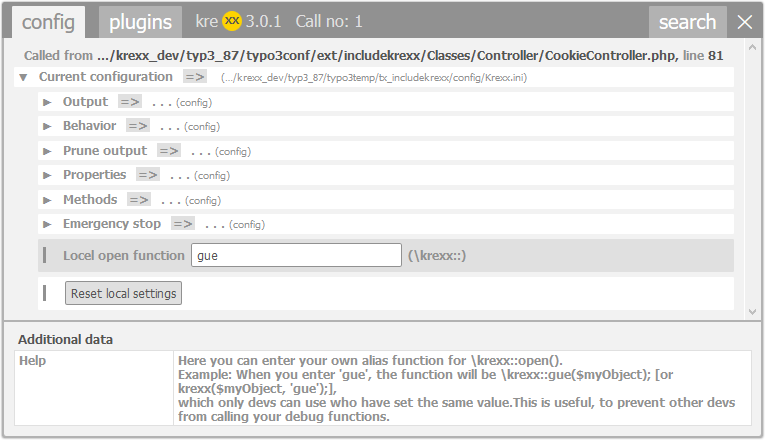

.. ==================================================
.. FOR YOUR INFORMATION
.. --------------------------------------------------
.. -*- coding: utf-8 -*- with BOM.

.. include:: ../../Includes.txt

.. _dev-handle:

Setting up a local opening function
===================================

Imagine the following situation:

There are several developers, designers and product owners working on your project, but you do not want them to trigger your kreXX output.
To achieve this, you can simply setup your own developer handle.

|

	Setting up a Developer Handle to use as a local opening function

Like all local configurations, this is stored in a cookie inside your browser. To make use of this setting, just use the following:

.. code-block:: php

	\krexx::gue($myObject);
	// or as an alias
	krexx($myObject, 'gue');

Only people with the string “gue” added to their local configuration will now be able to trigger an analysis. kreXX will be disabled for everyone else.

Debugging a live server
^^^^^^^^^^^^^^^^^^^^^^^
Using a local open function might tempt you to debug a productive server, since only browsers with this string in their cookie can trigger kreXX.

.. important::
  When it comes to debugging a productive  server, there is only one rule:

  Never ever debug a productive server. This will only lead to trouble.

