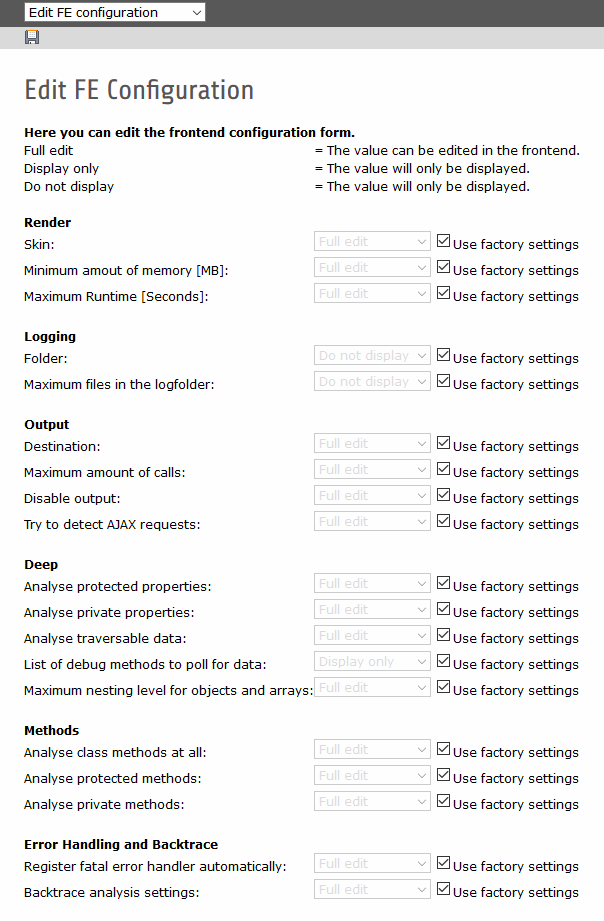

.. ==================================================
.. FOR YOUR INFORMATION
.. --------------------------------------------------
.. -*- coding: utf-8 -*- with BOM.

.. include:: ../../Includes.txt

.. _fe-configuration:

Edit FE Configuration
=====================

You can actually change which values can be edited on the frontend. To do this, we've also provided an editor.

For every control, you can set 3 different settings:

+---------+-------------------------------------------------------------------------------------------------------------------------------+
| Value   | meaning                                                                                                                       |
+=========+===============================================================================================================================+
| full    | You can fully edit this value in the frontend                                                                                 |
+---------+-------------------------------------------------------------------------------------------------------------------------------+
| display | kreXX will only display its current value. If there are any leftover settings in the settings-cookie, they will be ignored.   |
+---------+-------------------------------------------------------------------------------------------------------------------------------+
| none    | kreXX will not display this control or it's value. Leftover settings will be ignored.                                         |
+---------+-------------------------------------------------------------------------------------------------------------------------------+

