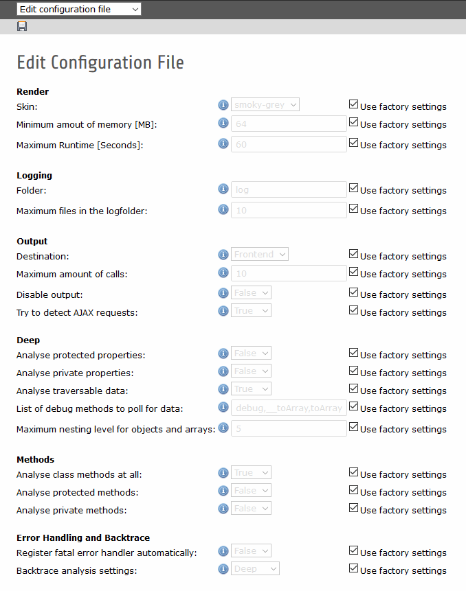
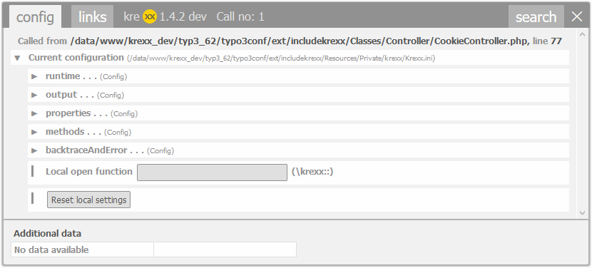

.. ==================================================
.. FOR YOUR INFORMATION
.. --------------------------------------------------
.. -*- coding: utf-8 -*- with BOM.

.. include:: ../Includes.txt

.. _config:

Configuration
=============

| You do not have to configure kreXX. It works very well out of the box.
| The configuration of kreXX is stored inside the file:

.. code-block:: typoscript

	uploads/tx_includekrexx/Krexx.ini

You do not have to edit this file manually. we have provided a backend editor for this.

Configuration Editor
--------------------

	Settings editor in the Typo3 backend

|
|

	Editor for the local cookie settings

.. toctree::
   :maxdepth: 1
   :titlesonly:
   :glob:

   Options/Index
   Frontend/Index
   Levels/Index