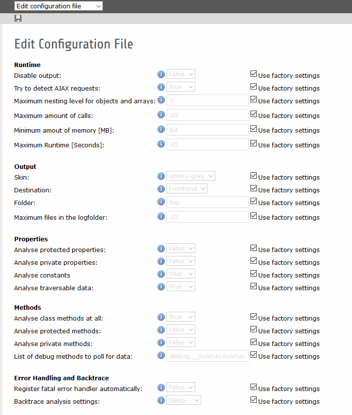

.. ==================================================
.. FOR YOUR INFORMATION
.. --------------------------------------------------
.. -*- coding: utf-8 -*- with BOM.

.. include:: ../../Includes.txt

.. _config_options:

Configuration options
=====================

We have provided an editor for the configuration file settings:

Output
------
+--------------------------------+----------------------------------------------------------------------------------------------------------------------------------------+---------------------------+
| Option                         | Description                                                                                                                            | Possible values / example |
+================================+========================================================================================================================================+===========================+
| Disable output                 | Is kreXX actually active?                                                                                                              | - true                    |
|                                |                                                                                                                                        | - false                   |
|                                | Here you can disable kreXX on a global level without uninstalling it.                                                                  |                           |
+--------------------------------+----------------------------------------------------------------------------------------------------------------------------------------+---------------------------+
| IP Range                       | IP white list (comma separated) with wildcard (*) support.                                                                             | 192.168.0.110,192.168.1.* |
|                                |                                                                                                                                        |                           |
|                                | List of IPs who can trigger kreXX. You can do something like '192.168.1.*', but not something like '192.168.*.110'.                    |                           |
+--------------------------------+----------------------------------------------------------------------------------------------------------------------------------------+---------------------------+
| Skin                           | You can change the CSS/HTML skin. We included the Hans and Smoky-Grey skin                                                             | - hans                    |
|                                |                                                                                                                                        | - smoky-grey              |
+--------------------------------+----------------------------------------------------------------------------------------------------------------------------------------+---------------------------+
| Destination                    | Will the output be sent to the frontend or the logfolder?                                                                              | - file                    |
|                                |                                                                                                                                        | - frontend                |
+--------------------------------+----------------------------------------------------------------------------------------------------------------------------------------+---------------------------+
| Maximum files in the logfolder | How many files should it keep? Files will only get deleted, when a new one is created.                                                 | 10                        |
+--------------------------------+----------------------------------------------------------------------------------------------------------------------------------------+---------------------------+

Runtime
-------
+--------------------------------+----------------------------------------------------------------------------------------------------------------------------------------+---------------------------+
| Option                         | Description                                                                                                                            | Possible values / example |
+================================+========================================================================================================================================+===========================+
| Try to detect AJAX requests    | Shall kreXX try to detect an AJAX request?                                                                                             | - true                    |
|                                |                                                                                                                                        | - false                   |
|                                | If set to true, there will be no output when AJAX is detected, to prevent a js error.                                                  |                           |
+--------------------------------+----------------------------------------------------------------------------------------------------------------------------------------+---------------------------+
| Maximum nesting level          | How deep shall we analyse objects?                                                                                                     | 5                         |
|                                |                                                                                                                                        |                           |
|                                | When kreXX reaches a certain level, it simply stops there and won’t go any further.                                                    |                           |
+--------------------------------+----------------------------------------------------------------------------------------------------------------------------------------+---------------------------+
| Maximum amount of calls        | How often can you call kreXX in one run?                                                                                               | 10                        |
|                                |                                                                                                                                        |                           |
|                                | kreXX can generate a lot of data, and depending on your settings increasing this number might not be a good idea.                      |                           |
+--------------------------------+----------------------------------------------------------------------------------------------------------------------------------------+---------------------------+
| Minimum amount of memory [MB]  | kreXX checks regularly how much memory is left. Here you can adjust the amount where it will trigger an emergency break. Unit of       | 64                        |
|                                | measurement is MB.                                                                                                                     |                           |
+--------------------------------+----------------------------------------------------------------------------------------------------------------------------------------+---------------------------+
| Maximum Runtime [Seconds]      | kreXX checks during the analysis how much time has elapsed since start. Here you can adjust how many seconds can pass until an         | 60                        |
|                                | emergency break will be triggered. Unit of measurement is seconds.                                                                     |                           |
+--------------------------------+----------------------------------------------------------------------------------------------------------------------------------------+---------------------------+
| Use scope analysis             | kreXX will analyse all values and methods that can be reached from the point where the analysis was called. This will automatically    | - true                    |
|                                | overwrite existing configurations, it can be considered the "auto config mode".                                                        | - false                   |
+--------------------------------+----------------------------------------------------------------------------------------------------------------------------------------+---------------------------+

Properties
----------
+--------------------------------+----------------------------------------------------------------------------------------------------------------------------------------+---------------------------+
| Option                         | Description                                                                                                                            | Possible values / example |
+================================+========================================================================================================================================+===========================+
| Analyse protected properties   | Shall kreXX create a reflection and poll it for data?                                                                                  | - true                    |
|                                |                                                                                                                                        | - false                   |
|                                | kreXX will analyse all protected properties of a class.                                                                                |                           |
+--------------------------------+----------------------------------------------------------------------------------------------------------------------------------------+---------------------------+
| Analyse private properties     | The same as :literal:`Analyse protected properties`, only for private properties.                                                      | - true                    |
|                                |                                                                                                                                        | - false                   |
+--------------------------------+----------------------------------------------------------------------------------------------------------------------------------------+---------------------------+
| Analyse constants              | kreXX will analyse all constants of a class.                                                                                           | - true                    |
|                                |                                                                                                                                        | - false                   |
+--------------------------------+----------------------------------------------------------------------------------------------------------------------------------------+---------------------------+
| Analyse traversable data       | Shall kreXX try to traverse through the object?                                                                                        | - true                    |
|                                |                                                                                                                                        | - false                   |
+--------------------------------+----------------------------------------------------------------------------------------------------------------------------------------+---------------------------+

Methods
-------
+--------------------------------+----------------------------------------------------------------------------------------------------------------------------------------+---------------------------+
| Option                         | Description                                                                                                                            | Possible values / example |
+================================+========================================================================================================================================+===========================+
| Analyse protected methods      | Shall kreXX analyse all protected methods of an object?                                                                                | - true                    |
|                                |                                                                                                                                        | - false                   |
+--------------------------------+----------------------------------------------------------------------------------------------------------------------------------------+---------------------------+
| Analyse private methods        | Shall kreXX analyse all private methods of an object?                                                                                  | - true                    |
|                                |                                                                                                                                        | - false                   |
+--------------------------------+----------------------------------------------------------------------------------------------------------------------------------------+---------------------------+
| Analyse getter methods         | Shall kreXX try to determine the output of getter methods?                                                                             | - true                    |
|                                | Getter methods will NOT get called to get a result.                                                                                    | - false                   |
|                                | Instead, kreXX tries to get the (possible) result from the properties of this class. If the getter method is used to compute this      |                           |
|                                | value, the values here may be inaccurate.                                                                                              |                           |
+--------------------------------+----------------------------------------------------------------------------------------------------------------------------------------+---------------------------+
| List of debug methods to poll  | Which additional methods shall be called from the object?                                                                              | debug,toArray,__toString, |
| for data                       |                                                                                                                                        | toString                  |
|                                | Comma separated list of methods. These methods are called without parameters. They also might do stuff which might be unwanted.        |                           |
+--------------------------------+----------------------------------------------------------------------------------------------------------------------------------------+---------------------------+

Backtrace
----------------------------
+--------------------------------+----------------------------------------------------------------------------------------------------------------------------------------+---------------------------+
| Option                         | Description                                                                                                                            | Possible values / example |
+================================+========================================================================================================================================+===========================+
| Maximum steps in the backtrace | A backtrace tends to produce a lot of output, and browsers tend to have problems with more than 100MB output in HTML text.             | 10                        |
|                                | Normally it is not unneccessary to go back more than 10 steps, but if you need to, you can increase this number here.                  |                           |
+--------------------------------+----------------------------------------------------------------------------------------------------------------------------------------+---------------------------+
