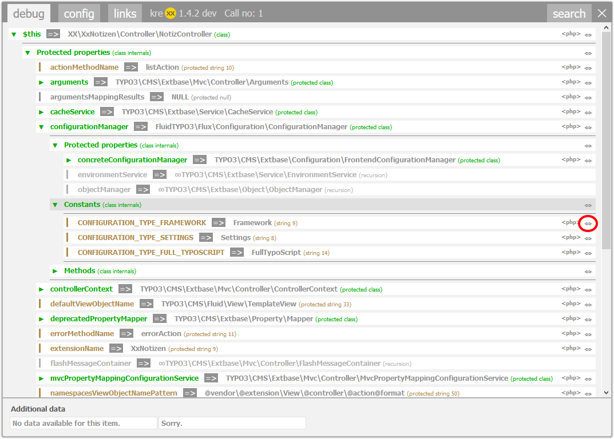
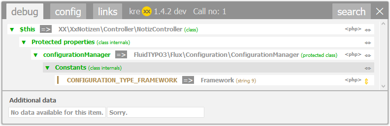

.. ==================================================
.. FOR YOUR INFORMATION
.. --------------------------------------------------
.. -*- coding: utf-8 -*- with BOM.

.. include:: ../../Includes.txt

.. _codebreadcrumbs:

Code breadcrumbs
================

Modern frameworks tend to have complicated objects.
Analysing them with kreXX will then produce a lot of output. And the values you are looking for might be buried in there somewhere.

The code breadcrumbs function does exactly this: It hides all the other values, to make the output more comprehensible.
A click on the arrow symbol will hide all other values, except the value itself and it's child-values.
Another click on will reset everything.

|

	Incomprehensible output with a lot of data. A simple click on the arrow symbol hides the rest of the output

|
|

	Better readable output, because unnecessary data is now hidden.

|
