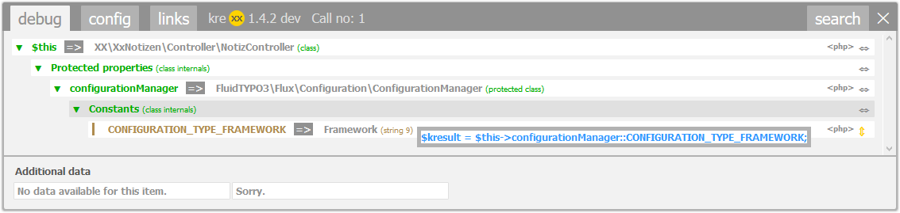

.. ==================================================
.. FOR YOUR INFORMATION
.. --------------------------------------------------
.. -*- coding: utf-8 -*- with BOM.

.. include:: ../../Includes.txt

.. _codegeneration:

Automatic code generation
=========================

Displaying only the values you want to know about is one thing. Reaching them via php code is something else entirely.

We have included an automatic code generation, which generates php-code to reach these values. There is a limitation, though. Most values you will come across are protected, and there is most likely a reason for this. kreXX will not generate code to make them public. A click on the <php> symbol will generate this code.

This also works in fluid.

|

	Code automatically generated

