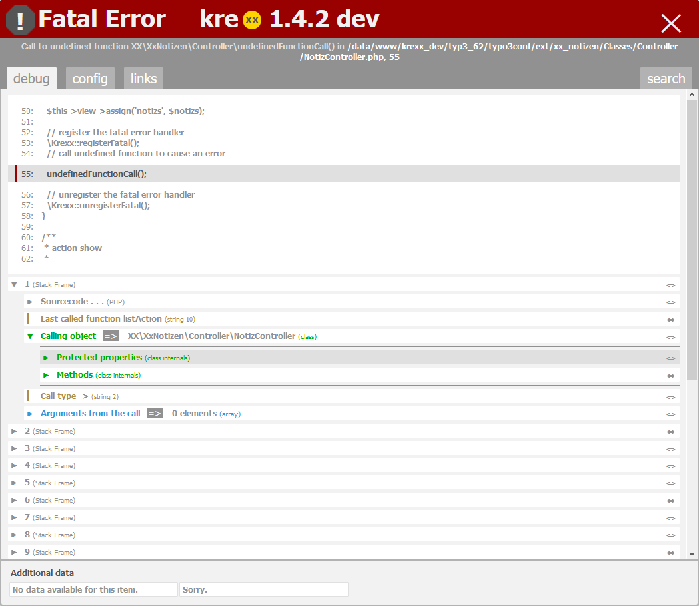

.. ==================================================
.. FOR YOUR INFORMATION
.. --------------------------------------------------
.. -*- coding: utf-8 -*- with BOM.

.. include:: ../../Includes.txt

.. _fatal-error:

Fatal Error Handler
===================

.. important::
  Fatal errors got removed in PHP7 and became catchable. TYPO3 ist very well able to handle them, so you do not have to resort kreXX for additional data.

| Normally, when a fatal error happens, php will tell you the name of the error, the filename and the line number.
| When you look at the amount of data available from the TYPO3 error handler for example, you will clearly see that this is a little bit, ummm discreet.
|

kreXX will offer you the following information:
	- Snippet of the sourcecode, where the error has happened
	- Complete backtrace of what happened before the error occurred
	- Snippets of sourcecode is added to each step of the backtrace
	- Each object in the backtrace is fully analysed with all its data
	- . . .

|
|

	kreXX fatal error handler features a completely analysed backtrace as well as parts of the sourcecode.

How it works
^^^^^^^^^^^^

When a fatal error occurs, the only way to actually do something is the shutdown function. The main problem here is, that the backtrace will not contain anything useful, you can not rely on php to provide these values.
Since php won't do this, kreXX will have to keep track of the backtrace. But by doing this, it will slow down your system to the extreme. This is why you will have to activate the handler.

.. code-block:: php

	// register the fatal error handler
	\kreXX::registerFatal();
	// unregister the fatal error handler
	\kreXX::unregisterFatal();
