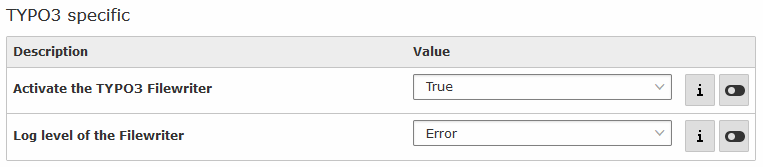

.. ==================================================
.. FOR YOUR INFORMATION
.. --------------------------------------------------
.. -*- coding: utf-8 -*- with BOM.

.. include:: ../../Includes.txt

.. _filewriter:

TYPO3 FileWriter
================

TYPOO3 has two differend logging systems:

- Database logging, which can be accessed by the Log module in the backend.
- File logging which can only be accessed by downloading the log via FTP.

kreXX offers a integration into the file logging by providing a FileWriter.

Integrate with the backend configuration
----------------------------------------

- Simply activate the logging integration in the backend module.

- Clear the cache
- Refresh the page with the :literal:`Oops` on the frontend.
- Access the log entry with te backend module.

Manual integration into the TYPO3 logging
-----------------------------------------

You can also integrate kreXX manually. Simply register it in your site package :literal:`ext_localconf.php`.
This way you can give it a different configuration from the rest of the the debug settings.

.. code-block:: php

	// Register kreXX as a new log writer
	$GLOBALS['TYPO3_CONF_VARS']['LOG']['writerConfiguration'] = [
	    // Using the error level, and above.
	    \TYPO3\CMS\Core\Log\LogLevel::ERROR => [
	        \Brainworxx\Includekrexx\Log\FileWriter::class => [
	            // Overwriting an existing configuration, allowing the scalar analysis.
	            \Brainworxx\Krexx\Service\Config\ConfigConstInterface::SETTING_ANALYSE_SCALAR => 'true'
	        ]
	    ]
	];

`Here <https://docs.typo3.org/m/typo3/reference-coreapi/master/en-us/ApiOverview/Logging/Configuration/Index.html#configuration-of-the-logging-system />`_ you can find additional documentation about the TYPO3 logging system.

Limits to the logging
---------------------

Logging may be turned off within the :literal:`$GLOBALS`. If this is done after kreXX loads, then the kreXX logging integration will not work.
The reason for this is simple: logging is turned off again, after kreXX added these settings.

