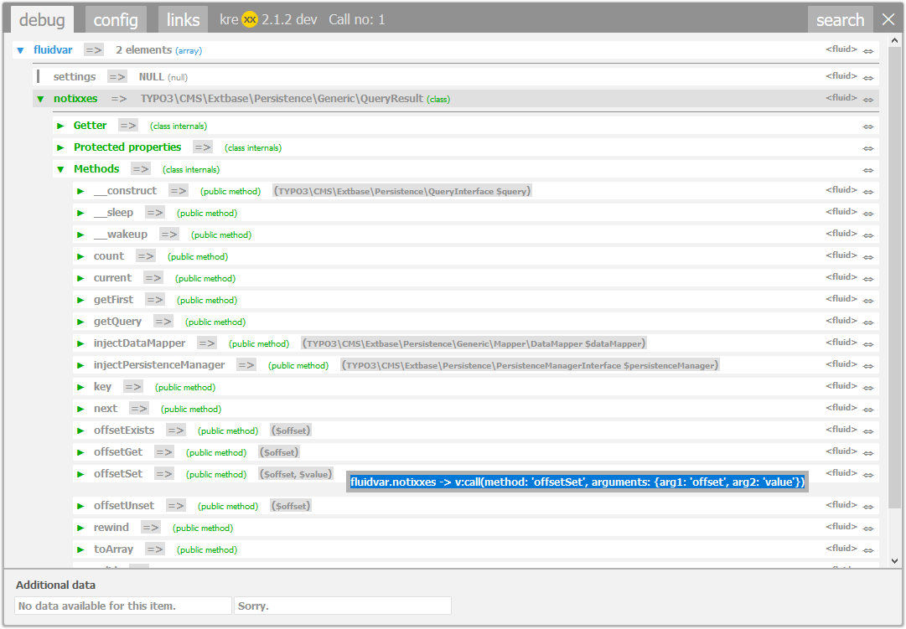

.. ==================================================
.. FOR YOUR INFORMATION
.. --------------------------------------------------
.. -*- coding: utf-8 -*- with BOM.

.. include:: ../../Includes.txt

.. _fluid-debugger:

Fluid Debugger
===================

kreXX does not only work in PHP. We have added a debug viewhelper for fluid.

Namespace
^^^^^^^^^

When using TYPO3 4.5 until 8.4, you need to declare the namespace first. If you are using TYPO3 8.5 and later, this will not be necessary anymore.

.. code-block:: html

    {namespace krexx=Tx_Includekrexx_ViewHelpers}

Then calling the viewhelper is pretty much straight forward:

.. code-block:: html

    <krexx:debug>{_all}</krexx:debug>

or

.. code-block:: html

    <krexx:debug value="{my: 'value', to: 'analyse'}" />

Use this part if you don't want fluid to escape your string or if you are stitching together an array.

|
|

	Fluid debugger output with source generation for fluid.

