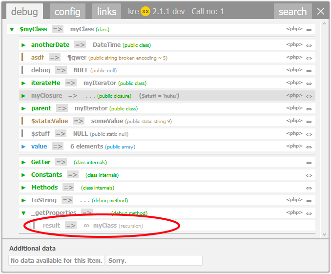

.. ==================================================
.. FOR YOUR INFORMATION
.. --------------------------------------------------
.. -*- coding: utf-8 -*- with BOM.

.. include:: ../Includes.txt

.. _features:

Features
========

Scope analysis
**************

When kreXX is called from the php code, it tires to analyse all class characteristics, that are accessible from the point where it was called. This is especially useful when calling something like:

.. code-block:: php

	krexx($this);

A lot more stuff can be reached from inside a class, and kreXX will analyse these properties and methods. The scope analysis can be considered as the auto config mode. It will automatically overwrite the settings
for protected and private properties/methods. It will not remove analysis results, only add everything that can be reached by normal means.

Getter analysis
***************
Getter methods are class methods that return values or objects. Most of these are stored inside the class in protected properties. kreXX will try to guess which property belong to these getters and analyse them.
This results in a much more complete overview of the class that is being analysed.

These getters will **not** get called, and this guessing may fail with the following results:

+---------+----------------------------------------------------------------------------------------------------------------------------------------------------------------------------------------------------------+
| NULL    | This means that the property itself exists, but has no value. The getter may create this value and only cache it inside the protected property. But since the method was not called, this value is NULL. |
+---------+----------------------------------------------------------------------------------------------------------------------------------------------------------------------------------------------------------+
| nothing | This means that kreXX was not able to get anything from the getter method.                                                                                                                               |
+---------+----------------------------------------------------------------------------------------------------------------------------------------------------------------------------------------------------------+

Recursion handling
******************
When going through a complicated framework, sooner or later kreXX will reach objects that have been analysed before. Analysing them again is only a waste of memory and time.

When a recursion is detected, krexx will render a grey recursion. Since the original analysis result is somewhere else in the output window, a rendered recursion contains only the info where to find the first output.
A click on the recursion will then copy the original analysis via java script into the place of the recursion.

	A simple click on this recursion will resolve it via js.

|
|

**Table of Contents**

.. toctree::
   :maxdepth: 1
   :titlesonly:
   :glob:

   Logging/Index
   Scalar/Index
   Search/Index
   CodeBreadcrumbs/Index
   CodeGeneration/Index
   Skins/Index
   ErrorHandling/Index
