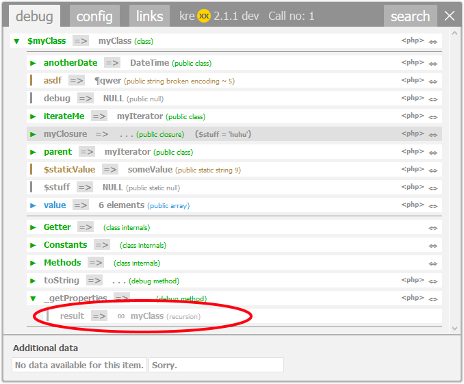

.. ==================================================
.. FOR YOUR INFORMATION
.. --------------------------------------------------
.. -*- coding: utf-8 -*- with BOM.

.. include:: ../../Includes.txt

.. _recursion:

Recursion handling
==================

When going through a complicated framework, sooner or later kreXX will reach objects that have been analysed before. Analysing them again is only a waste of memory and time.

When a recursion is detected, krexx will render a grey recursion. Since the original analysis result is somewhere else in the output window, a rendered recursion contains only the info where to find the first output.
A click on the recursion will then copy the original analysis via java script into the place of the recursion.

	A simple click on this recursion will resolve it via js.
