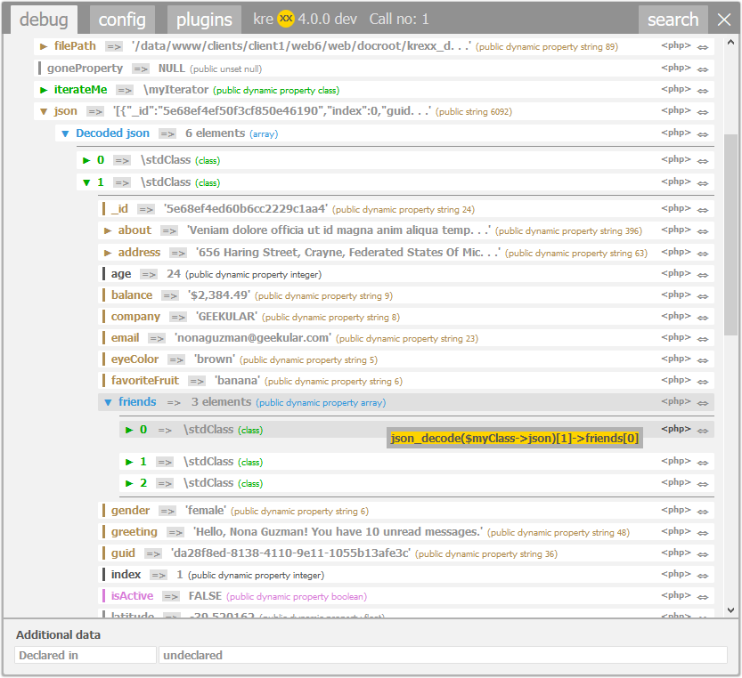
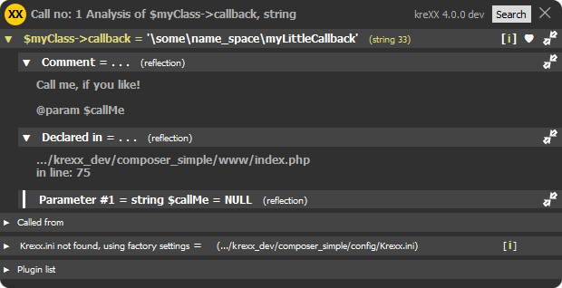

.. ==================================================
.. FOR YOUR INFORMATION
.. --------------------------------------------------
.. -*- coding: utf-8 -*- with BOM.

.. include:: ../../Includes.txt

.. _scalar:

Scalar analysis
===============

.. important::
	This feature is deactivated by default.

A string value can host a lot of information. When dealing with a webservice, there is a good chance that you will get a json or xml as an answer.
Taking a closer look at these may reveal a lot of information.
|
There is a downside, though. Facing a class structure with more than 20 XML or JSON strings will result in a lot of output, which may cause problems.
That is why this feature is deactivated by default.

JSON
----

When kreXX encounters a json, it does the following:

- Decode it and analyse it's content.
- Offer source generation to reach the decoded values.
- Output a pretty print for better readability
- Output the original string

|

.. figure::  ../../Images/Skins/smoky-grey.png
	:width: 833px
	:alt: Code generation for a lorem ipsum sample data json

	Code generation for a lorem ipsum sample data json.

XML
---

When kreXX encounters a xml, it does the following:

- Parse it into an array and analyse it's content
- Output a pretty print for better readability
- Output the original string

|

	Pretty print for a lorem ipsum sample data xml.

Filepath
--------

When kreXX encounters a file path, it does the following:

- Retrieve the realpath() and output it
- Analyse the mime type of the file

Callback
--------

When kreXX encounters a callback, it does the following:

- Output the comment for the method.
- Output the file and line of the declaration
- Analyse the parameters

|

	Callback analysis with comments and parameters.