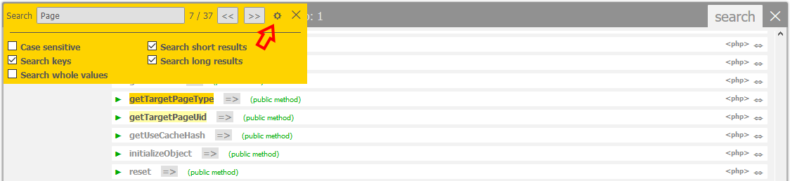
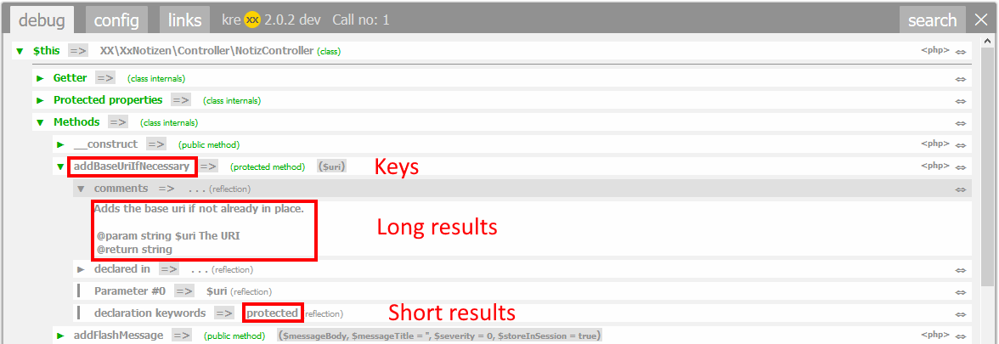

.. ==================================================
.. FOR YOUR INFORMATION
.. --------------------------------------------------
.. -*- coding: utf-8 -*- with BOM.

.. include:: ../../Includes.txt

.. _search:

Search function
===============

| Getting a lot of output is only nice, as long as you know where to find stuff.
| Imagine the following scenario: You are searching for a specific value, function or property somewhere deep inside a specific debug output "window".

kreXX offers a somewhat advanced search function:

- Marking all appearances
- Open the collapsed nodes to the output
- Scrolls down to each finding
- Each output "window" can be searched individually.

	Search function in action

Search options
^^^^^^^^^^^^^^

There are 4 options to make searching easier:

- Case sensitive toggles the case sensitive of the search
- Search keys
- Search short results
- Search long results

	What is what in the options