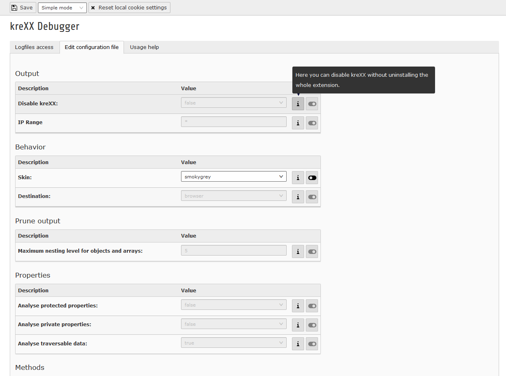

.. _backend:

================
Backend settings
================

You do not have to configure kreXX. It works very well out of the box. There are two ways to configure kreXX:

1. Edit configuration file settings in the backend
2. Edit local cookie settings in every debug output

The configuration editor can be found on the second tab of the backend module.

    Backend settings editor

The toggle button on the right will enable the setting. The info button on the right will display a short description about the specific setting.
To save the desired configuration, simply click on the save button on the top.