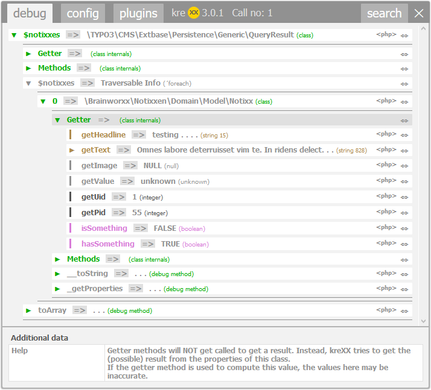

.. ==================================================
.. FOR YOUR INFORMATION
.. --------------------------------------------------
.. -*- coding: utf-8 -*- with BOM.

.. include:: ../Includes.txt

What does it do?
================

kreXX will be called from within the PHP source code:

.. code-block:: php

	krexx($myObject);

Key features:
	- Dumping of protected variables
	- Dumping of private variables
	- Dumping of traversable data
	- Configurable debug callbacks, which will be called on objects (if present). The output will then be dumped.
	- Analysis of the methods of objects (comments, where declared, parameters). Comment dumping supports :literal:`{@inheritdoc}`.
	- Output is draggable and has a closing button.
	- All features can be globally configured with a backend editor.
	- All features can be locally configured in the browser. The settings will be stored in a cookie.
	- Configurable local opening function, to prevent other developers from calling your debug commands.
	- Output can be saved to an output folder. Very useful in m2m communication.
	- Several security measures to prevent prevent hangups with too large memory usage or a timeout.
	- Benchmarking
	- Fatal error handler with a full backtrace
	- Code generation to reach the displayed values, if possible.

	Analysis of an extbase query result
