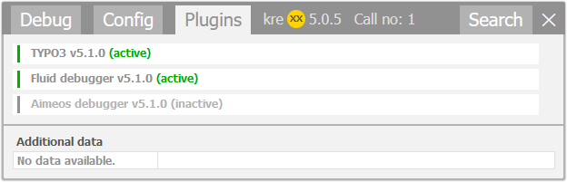

.. _krexxvsincludekrexx:

=====================
kreXX vs includekrexx
=====================

There are two debuggers that you may call :literal:`kreXX`:

- :literal:`kreXX`
- :literal:`includekrexx`

And both are being developed by BRAINWORXX GmbH.

- kreXX is a pure PHP debugger.
- Includekrexx is a TYPO3 extension with special features for Fluid, TYPO3 and Aimeos.

If you want to make full use of kreXX, we recommend using the TYPO3 extension includekrexx.