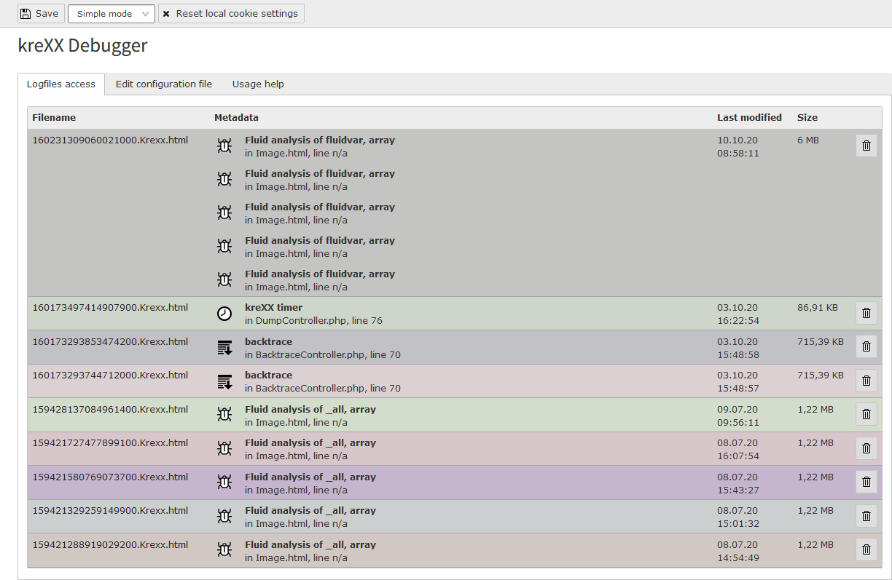

.. _logging:

=======
Logging
=======

To use kreXX as a logger simply use the logger ViewHelper:

.. code-block:: html

    <krexx:log>{_all}</krexx:log>

The access to the logs files can be found in the first tab of the backend module. The list is automatically updated by
ajax every few seconds.

Each entry has a unique colour to make new files better recognisable,

    Logfiles backend menu

To make these logfiles easier accessible, we have provided a backend menu, where you can easily view them. The list is
automatically updated.

To prevent these files from clogging up your system, kreXX will only keep **10** files and automatically delete older
ones. This value can also be changed the logging option **Maximum files in the log folder** to any number bigger than **0**.

A file can be access by simply clicking on the filename. The trashcan on the right deletes the file.

    Logfiles in the Admin Panel

Alternatively, you can access the logfiles by using the TYPO3 Admin Panel.
