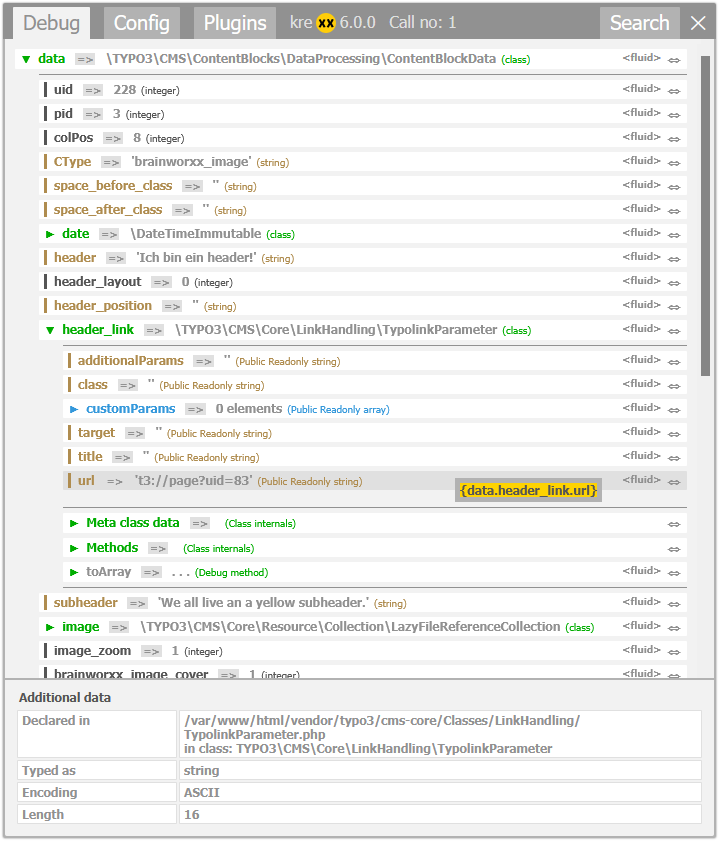

.. _whatDoesItDo:

What does it do?
================

To put it simply: Includekrexx is a simple alternative for the fliud debugger :literal:``<f:debug/>`.

The problem with :literal:``<f:debug/>` is that is can be a little bit discrete when debugging objects.
It only shows protected properties which may or may not be reachable it the template file.

Includekrexx gives you a good overview about the object and how to reach specific values inside.

.. code-block:: html

    <!-- Normal frontend output -->
    <krexx:debug>{_all}</krexx:debug>
    <!-- Force the logging into a file -->
    <krexx:log>{_all}</krexx:log>

You can also use it as a PHP debugger:

.. code-block:: php

    krexx($myObject);
