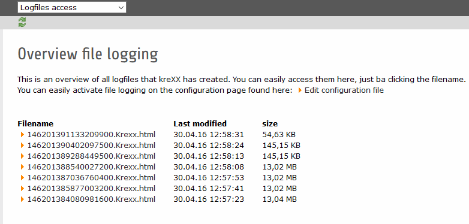

.. ==================================================
.. FOR YOUR INFORMATION
.. --------------------------------------------------
.. -*- coding: utf-8 -*- with BOM.

.. include:: ../Includes.txt

.. _logging:

Logging
=======

Normally, the output of kreXX is send straight to the browser. But there are always situations when this is highly impractically:

- Debugging the server side of an ajax request
- Dealing with a REST / soap service
- Sending other developers the kreXX output
- . . .

You can configure kreXX to output it's data inside a file instead of trying to send it to the browser. How to do this, is explained in the chapter :ref:`config_options`.
Just change the output option **Destination** from **frontend** to **file**.

|
|

kreXX will store all logfiles inside the directory

.. code-block:: typoscript

	typo3conf/ext/includekrexx/Resources/Private/krexx/log

| All debug data from one request will be stored inside two single files, one with the HTML output and a json with some meta data for the backend.
| To prevent these files from clogging up your system, kreXX will only keep 10 files and automatically delete older ones. This value can also be changed the logging option **Maximum files in the logfolder** to any number bigger than **0**.
| You can also delete these files in the backend .

|

	To make these logfiles easier accessible, we have provided a backend menu, where you can easily view them.

|

| And please remember, when it comes to debugging a live server, there is only one rule:
| **Never ever debug a live server. This will only lead to trouble.**
