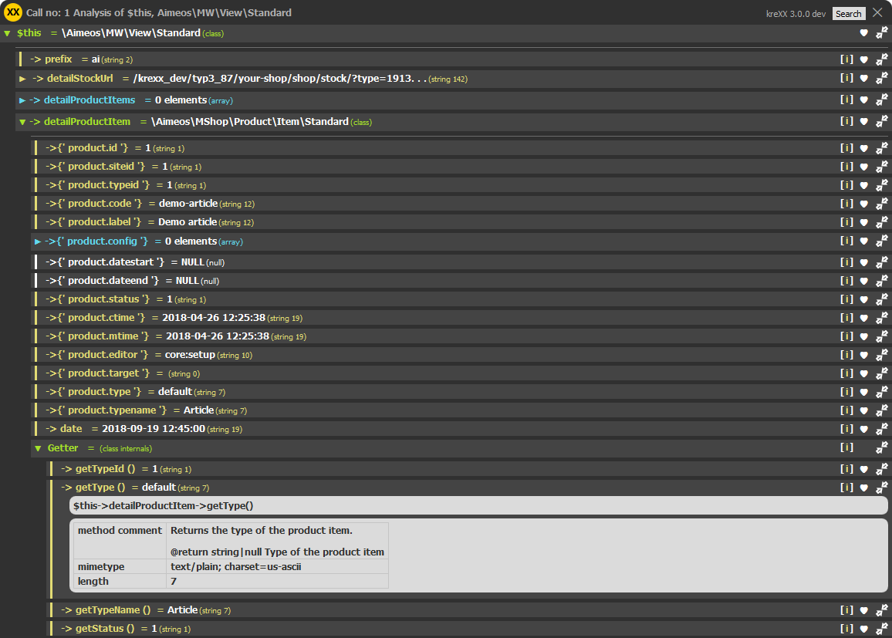
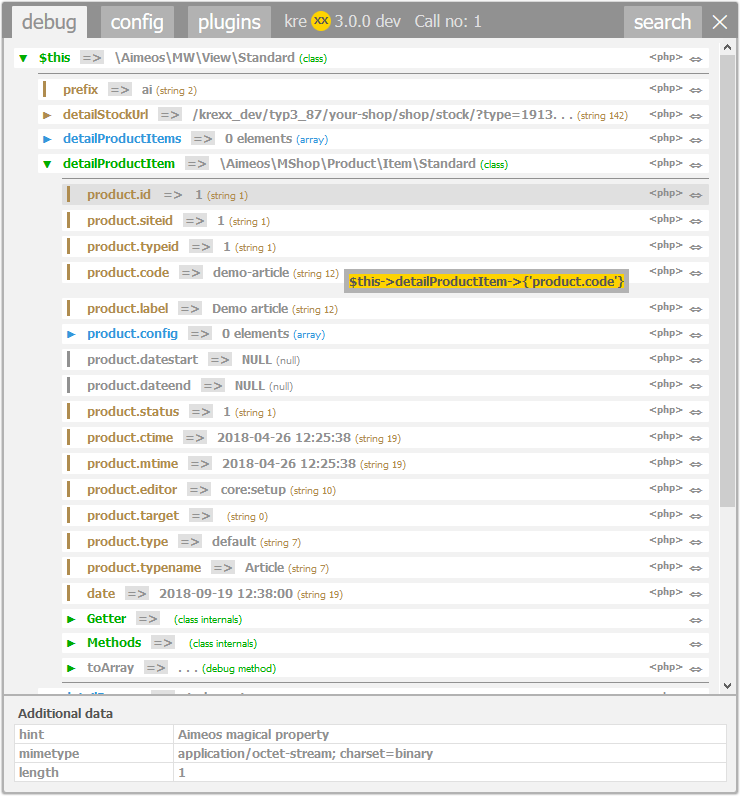
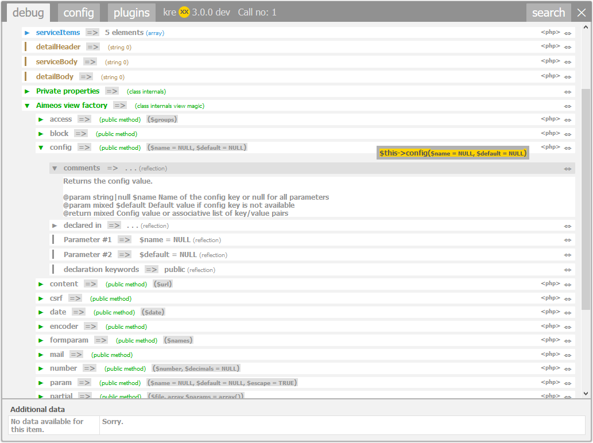

.. ==================================================
.. FOR YOUR INFORMATION
.. --------------------------------------------------
.. -*- coding: utf-8 -*- with BOM.

.. include:: ../../Includes.txt

.. _aimeos:

Aimeos debugger
===============

There is a lot of php magic happening in the aimoes shop. When getting informations out of objects, items or views you have to use them.
With the used decorator pattern in place, you can may have a hard time finding the information you need.

Features
  - Advanced getter analysis previews the value you will get when using this getter.
  - Resolving the magical properties which get provided by :literal:`__get()`
  - Analysis of all known view helpers inside the view
  - PHP code generation, to help you access these values

	The getter analysis resolves the values stored inside the objects, offers source code generation to reach them, as well as some additional meta data.

	Analysis of a magical property from a shop item.

	Analysis of a Aimeos view helper with source generation and comments from the source code.