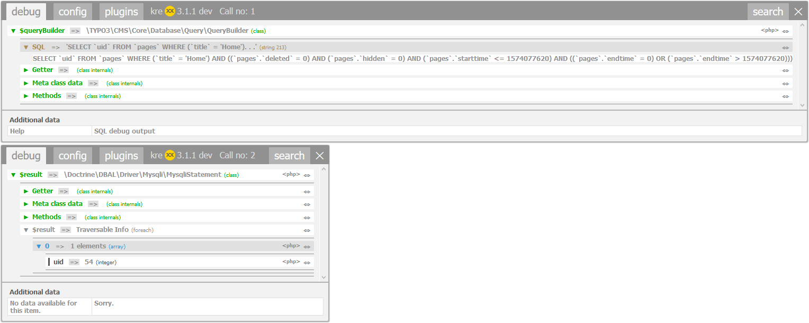

.. ==================================================
.. FOR YOUR INFORMATION
.. --------------------------------------------------
.. -*- coding: utf-8 -*- with BOM.

.. include:: ../../Includes.txt

.. _typo3:

TYPO3
=====

Configuration
^^^^^^^^^^^^^

The TYPO3 plugin applies the following changes to the kreXX standard behavior:
    - The log folder is set to :literal:`typo3temp/tx_includekrexx/log`.
    - The chunks folder is set to :literal:`typo3temp/tx_includekrexx/chunks`.
    - The configuration folder is set to :literal:`typo3temp/tx_includekrexx/config`.
    - Blacklisting of several debug methods, to prevent errors.
    - Make use of the TYPO3 implementation for the IP filter, because it is more versatile than the kreXX version.

SQL Debugger
^^^^^^^^^^^^
Writing a complicated SQL query with the doctrine query builder can be a difficult task. kreXX offers some assistance here:

When analysing a query builder or a query object itself, kreXX tries to extract the sql query from the object.

.. code-block:: php

    $queryBuilder = GeneralUtility::makeInstance(ConnectionPool::class)->getQueryBuilderForTable('pages');
    $queryBuilder
        ->select('uid')
        ->from('pages')
        ->where($queryBuilder->expr()->eq('title', $queryBuilder->createNamedParameter('Home')));

    krexx($queryBuilder);
    $result = $queryBuilder->execute();
    krexx($result);

