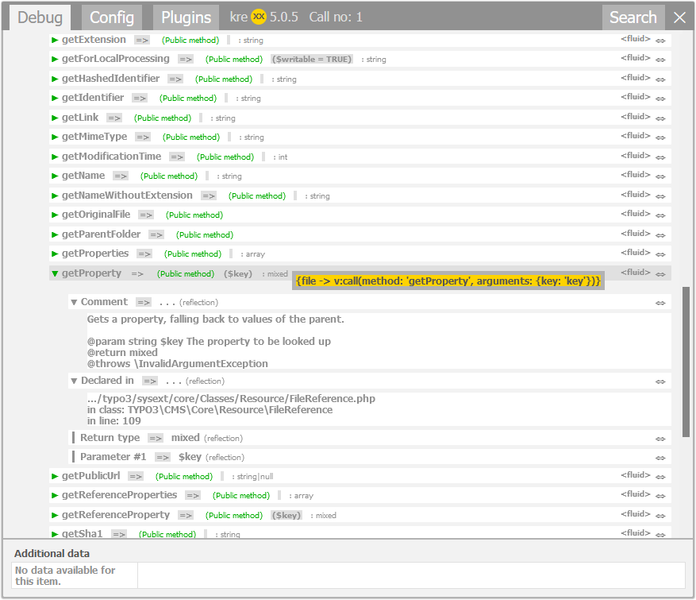
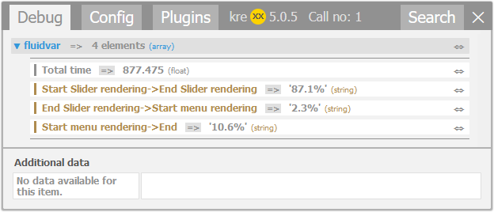

.. _fluid:

Usage in Fluid
==============

The debugging ViewHelpers
^^^^^^^^^^^^^^^^^^^^^^^^^

Using the ViewHelpers is pretty much straight forward:

.. code-block:: html

    <!-- Normal frontend output -->
    <krexx:debug>{_all}</krexx:debug>
    <!-- Use this part if you don't want fluid to escape your string or if you are
         stitching together an array. -->
    <krexx:debug value="{my: 'value', to: 'analyse'}" />
    <!-- Force the logging into a file -->
    <krexx:log>{_all}</krexx:log>
    <krexx:log value="{my: 'value', to: 'analyse'}" />

    Fluid debugger output with source generation for fluid.

kreXX will then try to analyse everything inside the variable given to it. All reachable properties will be shown in the
debugger output.

From a Fluid template point of view, array, object getters and object public methods are handeld in the same way. kreXX
will do the same when displaying them.

Benchmarking ViewHelpers
^^^^^^^^^^^^^^^^^^^^^^^^

.. code-block:: html

    <!-- Take a moment -->
    <krexx:timer.moment value="Start rendering"/>
    <!-- A lot more template code -->
    . . . .
    <!-- Take another moment -->
    <krexx:timer.moment value="Start menu rendering"/>
    <!-- Even more template code -->
    . . . .
    <!-- Output the benchmark -->
    <krexx:timer.end/>

kreXX measures the time between every call, and then outputs it as a benchmark.

    Fluid debugger output with benchmarking.

.. warning::
    As seen in the example screenshot, the rendering order may not be what you expect. When using the benchmarking
    ViewHelpers across different template files, make sure to call them in the correct order. kreXX will stop to
    measure the time when you call the end ViewHelper :literal:`<krexx:timer.end/>`.