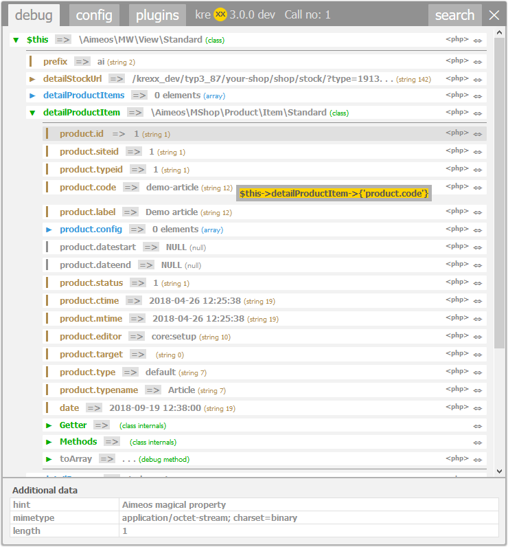
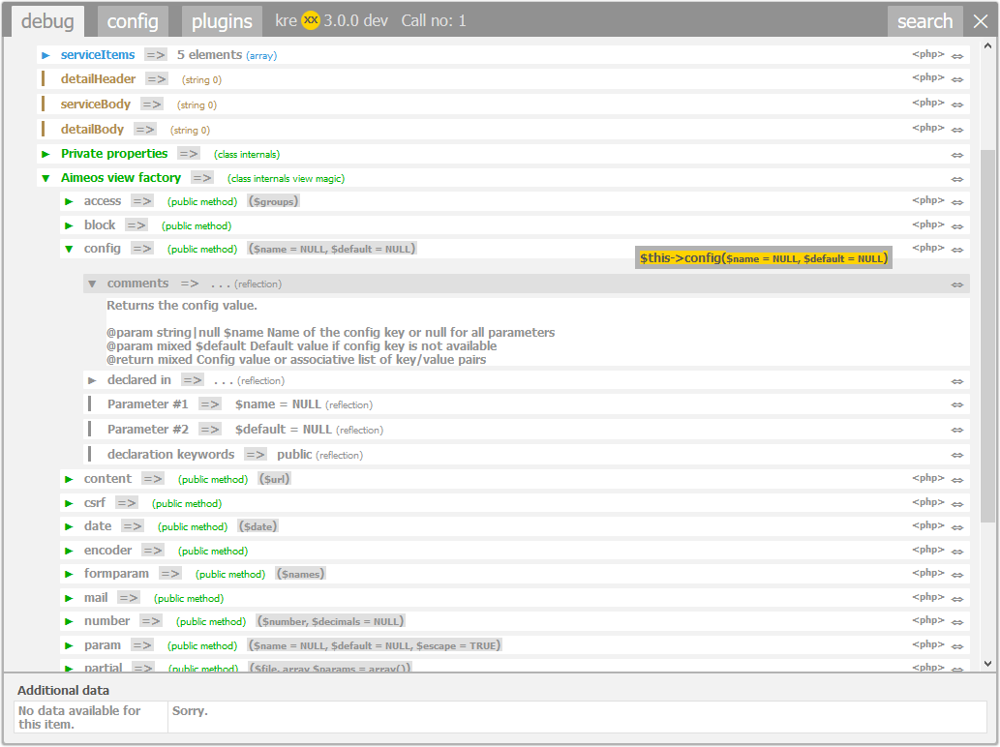

.. _php:

==========================
Usage in PHP (with Aimeos)
==========================

The shop framework Aimeos is extremely powerful and flexible. But it works a lot with Magic Methods and decorators.
This makes it hard to understand the Xdebug output and how to access certain values, or methods.

Includekrexx has support for Aimeos. We have added special analysers for the Aimeos classes and decorators.

Main analytic function
^^^^^^^^^^^^^^^^^^^^^^

.. code-block:: php

    // Analyse a variable
    krexx($myObject);
    // Force kreXX to write an analysis into a log file.
    krexxlog($myObject);
    // Do a backtrace and analyse it.
    \Krexx::backtrace();
    // Force kreXX to write a backtrace analysis into a log file
    \Krexx::logBacktrace();

    Analysis of a magical property from a shop item.

    Analysis of a Aimeos view helper with source generation and comments from the source code.

