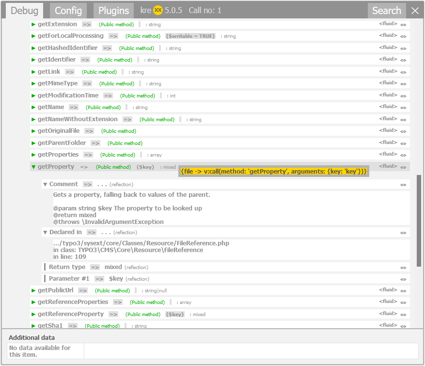

.. _codegeneration:

===============
Code generation
===============

Displaying the values you want to know about is one thing. Reaching them is something else entirely.

We have included an automatic code generation, which generates code snippets to reach these values. There is a limitation,
though. Most values you will come across are protected, and there is most likely a reason for this.

A click on the :literal:`<fluid>` or :literal:`<php>` symbol will generate the snippet.

.. figure:: ../../Images/CodeGeneration.png
    :class: with-shadow d-inline-block
	:alt: Snippet generation

	Output of the generated snippet.

Calling methods from an object that are not getters (has'ers or is'ers) is not possible normally. You need to install
the VHS extension to be able to call these methods. The extension is not part of the TYPO3 core, but is a very useful tool overall.

VHS can be found here: `VHS <https://extensions.typo3.org/extension/vhs/>`__.

	You need to install VHS to use this snippet.