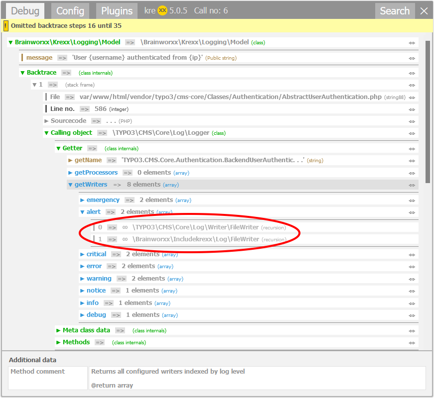

.. _recursion:

==================
Recursion handling
==================

When going through a complicated framework, sooner or later kreXX will reach objects that have been analysed before.
Analysing them again is only a waste of memory and time.

When a recursion is detected, krexx will render a grey recursion. A click on the recursion will then copy the original
analysis into the place of the recursion.

	A simple click on this recursion will resolve them.
