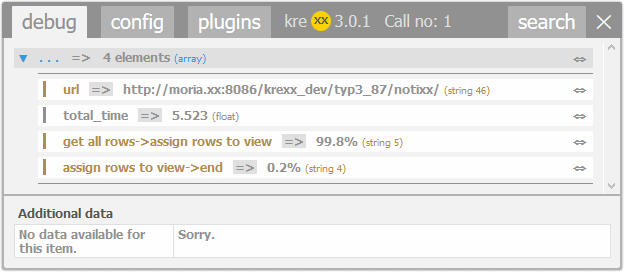
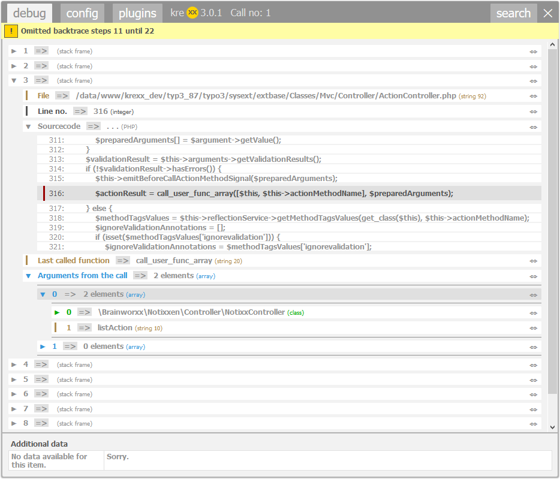

.. ==================================================
.. FOR YOUR INFORMATION
.. --------------------------------------------------
.. -*- coding: utf-8 -*- with BOM.

.. include:: ../Includes.txt

.. _usage:

Usage inside the PHP code
=========================

Main analytic function
^^^^^^^^^^^^^^^^^^^^^^

.. code-block:: php

    krexx($myObject);
    // Or as an alias:
    \Krexx::open($myObject);
    // Or even inline.
    json_encode(krexx($myObject));
    json_encode(\Krexx::open($myObject));

|

.. figure:: ../Images/main_function.png
    :width: 678px
    :alt: analysis of an extbase query result

Forced logging
^^^^^^^^^^^^^^

Force kreXX to write the analysis into a logfile:

.. code-block:: php

    // Force kreXX to write an analysis into a log file.
    \Krexx::log($myObject);
    // Force kreXX to write a backtrace into a log file
    \Krexx::logBacktrace();
    // Force the timer output into a log file
    \Krexx::logTimerEnd();

Wen using the forced logging, the following things will happen:

- Output destination is set to file by force.
- Ajax requests will get logged by force.

Benchmarking
^^^^^^^^^^^^

.. code-block:: php

    \Krexx::timerMoment('get all rows');
    $notixxes = $this->notixxRepository->findAll();
    \Krexx::timerMoment('assign rows to view');
    $this->view->assign('notixxes', $notixxes);
    \Krexx::timerEnd();

|

Backtrace
^^^^^^^^^

.. code-block:: php

    \Krexx::backtrace();

|

Exception handler
^^^^^^^^^^^^^^^^^

.. code-block:: php

    // register the exception handler
    \Krexx::registerExceptionHandler();
    // call undefined function to cause an error
    undefinedFunctionCall();
    // unregister the exception handler
    \Krexx::unregisterExceptionHandler();

|

.. figure:: ../Images/Usage/error_handler.png
    :width: 1049px
    :alt: kreXX error handler

Scope analysis
^^^^^^^^^^^^^^
Often enough a kreXX call will look like this:

.. code-block:: php

    krexx($this);

Analysing :literal:`$this` means, that all protected and private values and methods are reachable from this point inside the code. When kreXX notices this, it will analyse all reachable variables and methods of this class.
