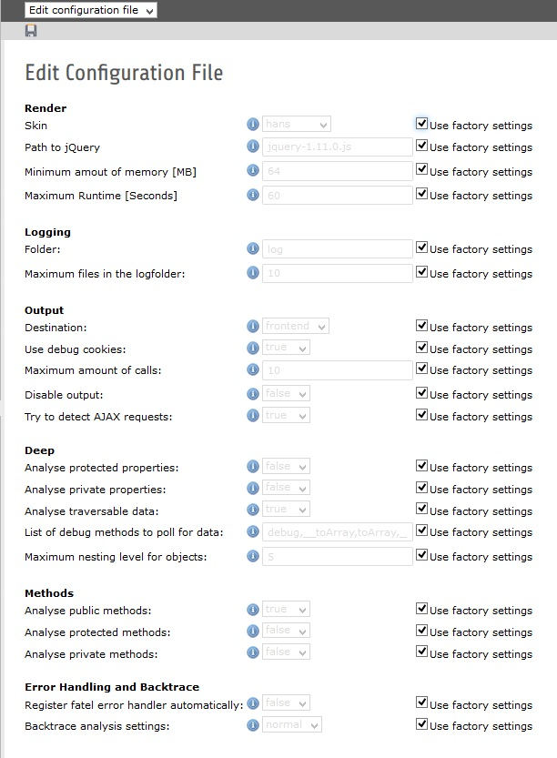
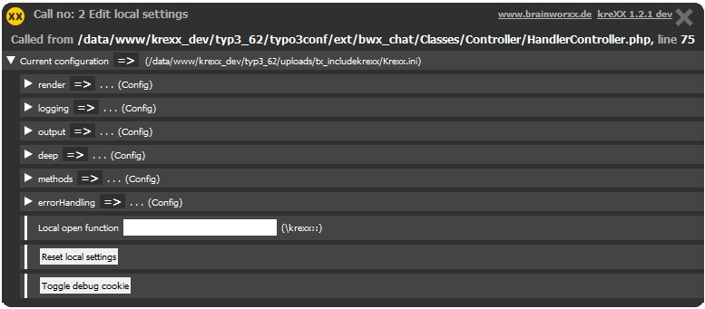

.. ==================================================
.. FOR YOUR INFORMATION
.. --------------------------------------------------
.. -*- coding: utf-8 -*- with BOM.

.. include:: ../Includes.txt

.. _config-levels:

Configuration levels
====================
There are 3 levels of configuration:

- Factory settings
- Configuration file settings
- Local browser settings

| The factory settings are hardcoded default settings, in case there is no configuration available
| The configuration file settings can be edited in the Typo3 backend.
| Local browser settings can be changed in the kreXX output window.
|
| Exception to this hierarchy rule:
| Once you disable kreXX on file or local level, it stays disabled.
| Bur remember: Local settings only apply to your current browser.

Configuration File Editor
-------------------------
kreXX should work very well straight out of the box with the factory settings. We have provided a settings editor in the backend, so you do not have to change any files by hand. Configuration file settings overwrite factory settings.

Configuration Cookie Editor
---------------------------
You can edit the local browser settings on the fly in the footer of the kreXX output. They are stored in a cookie, and only affect your current browser. Unlike the configuration file, not all settings can be edited there by default (this can be changed in the backend). Local browser settings overwrite configuration file settings.

