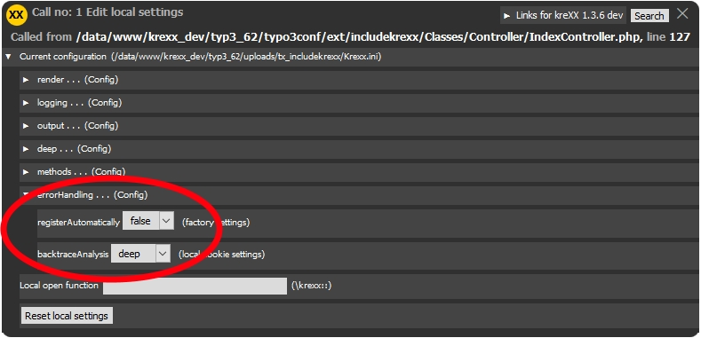
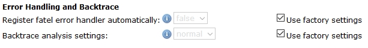

.. ==================================================
.. FOR YOUR INFORMATION
.. --------------------------------------------------
.. -*- coding: utf-8 -*- with BOM.

.. include:: ../Includes.txt

Fatal Error Handler
===================

| Normally, when a fatal error happens, php will tell you the name of the error , and filename and the line number.
| When you look at how typo3 handels other errors, you will clearly see that this is a little bit discreet.
|
|

.. figure:: ../Images/FatalError/fatal.jpg
	:width: 959px
	:alt: kreXX fatal error handler

	kreXX fatal error handler features a completely analysed backtrace as well as parts of the sourcecode.

How to activate it
^^^^^^^^^^^^^^^^^^

| When a fatal error occures, the only way to actually do something here is the shutdown function. The main problem here is, that the backtrace will not contain anything useful, you can not rely on php to provide these values.
| Since php won't do this, kreXX will have to keep track of the backtrace. But by doing this, it will slow down your system to the extreme. This is why you will have to activate the handler.
|
| There are to ways of doing this:

Activation in the php code
--------------------------

| This is the mos efficiant way to activate the handler, because is it only active where it is needed. The slowdown will be minimal.

.. code-block:: php

	// register the fatal error handler
	\kreXX::registerFatal();
	// unregister the fatal error handler
	\kreXX::unregisterFatal();

Activation in the settings
--------------------------

| When it is activated in the settings, the handler will be registered by kreXX as soon as krexx is incuded into typo3 (whicvh is very early.
| This will slow down your system very efficiently, so use this only when you have to.
|
|

	Activate the fatal error handler via your local cookie settings.

|
|
|
|
|

	Activate it globaqlly in yout typo3 installation in the configuration editor.