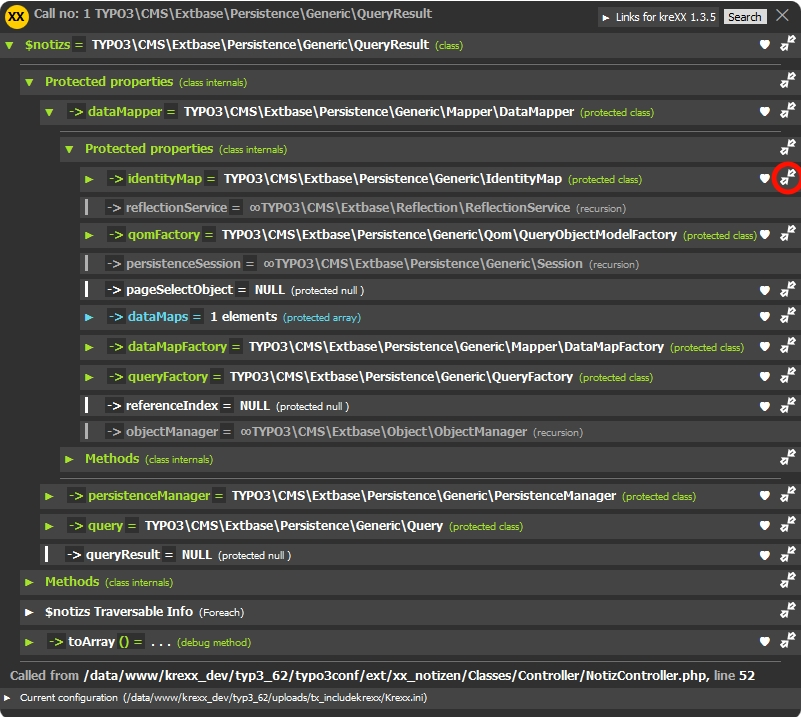
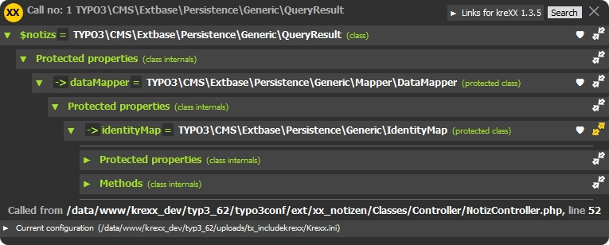
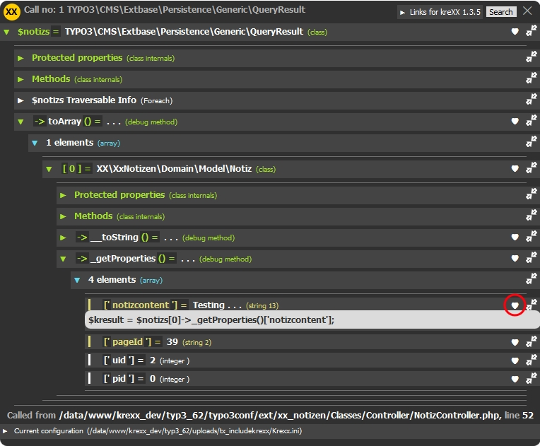

.. ==================================================
.. FOR YOUR INFORMATION
.. --------------------------------------------------
.. -*- coding: utf-8 -*- with BOM.

.. include:: ../Includes.txt

Little helpers
==============

| kreXX can produce a lot of output. And when you are on the 5'th level of the 7'th object, things will get confusing and hard to read.
| To minimize confusion, the kreXX output offers two little helpers:

Hide-Everything-Else
^^^^^^^^^^^^^^^^^^^^

| Modern frameworks tend to have complicated objects.
| Analysing them with krexx will then produce a lot of output. And the values you are looking for micht be burried in there soomewhere.
| The Hide-Everything-Else function does exactly this: It hides all the other values, to make the oputput more comprehensible.
| A click on the arrow symbol will hide all other values, except the value itself and it's child-values.
| Another click on will reset everything.
|
|

	Incomprehensible output with a lot of data. A simple click on the arrow symbol hides the rest of the output

	Better readable output, because unnecessary data is now hidden.

Automatic code generation
^^^^^^^^^^^^^^^^^^^^^^^^^

| Displaying only the values you want to know about os one thing. Reaching them via php code is something else entirely.
| We have included an automatic code generation, which generates php-code to reach these values.
| There is a limitation, though. Most values you will come accross are protected, and there is most likely areason for this. kreXX will not generate code to make them public.
| A click on the heart symbol will generate this code.
|
|

	Code automatically generated